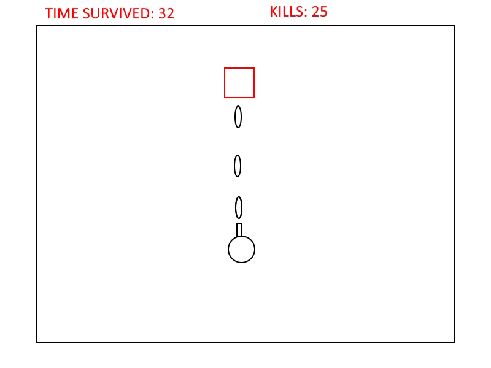

:warning: Everything between << >> needs to be replaced (remove << >> after replacing)

# << Basic Top Down Shooter >>
## CS110 Final Project  Fall 2024

## Team Members

Abrar Ahmed

***

## Project Description

A top down view video game where the goal is to survive as long as possible by killing enemies.

***    

## GUI Design

### Initial Design

### Final Design

## Program Design

### Features

1. Start menu/Home screen
2. Moveable character
3. Projectile firing
4. Enemies which automatically move towards the player
5. Game over screen
6. Leaderboard/High score tracker

### Classes

- << You should have a list of each of your classes with a description >>

## ATP

| Step                 |Procedure             |Expected Results                   |
|----------------------|:--------------------:|----------------------------------:|
|  1                   | Run Counter Program  |GUI window appears with count = 0  |
|  2                   | click count button   | display changes to count = 1      |
etc...
