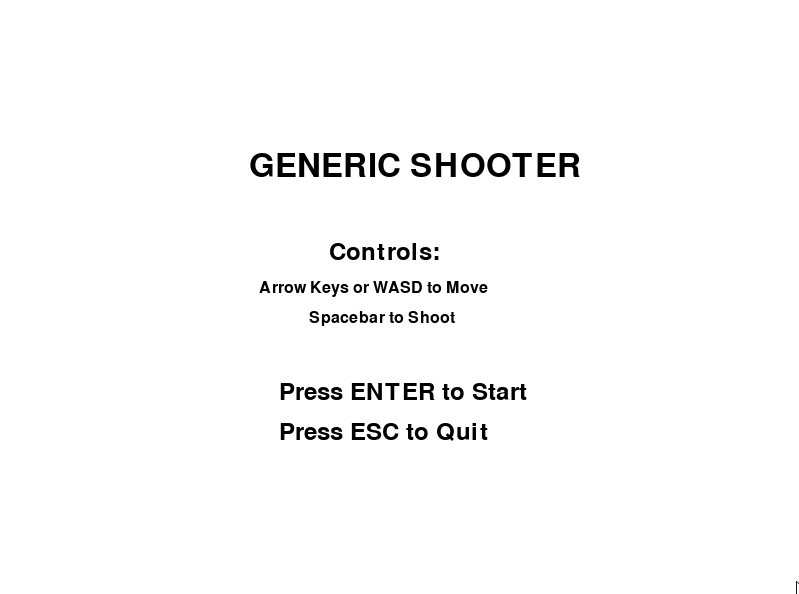

# Basic Top Down Shooter
## CS110 Final Project  Fall 2024

## Team Members

Abrar Ahmed

***

## Project Description

A top-down view video game where the goal is to survive as long as possible by killing enemies. The game features a dynamic and interactive gameplay environment where players can move, shoot, and fend off waves of enemies. High scores are tracked and stored for replayability and competition.

***

## GUI Design

### Initial Design

### Final Design

***

## Program Design

### Features

1. Start menu/Home screen.
2. Moveable character controlled by arrow keys or WASD.
3. Projectile firing (spacebar to shoot).
4. Enemies that spawn at random positions and chase the player.
5. Game over screen showing the time survived and total kills.
6. High score tracker stored in `scores.txt`.

### Classes

- **Player**: Manages the player's position, movement, and rendering. Handles controls for both arrow keys and WASD.
- **Bullet**: Represents projectiles fired by the player, including their position, movement, and rendering.
- **Enemy**: Represents enemies that chase the player. Includes behavior for movement, collision detection, and interaction with bullets and the player.
- **ScoreManager**: Tracks and stores the player's score, including kills and time survived. Handles saving high scores to a file.
- **SoundManager**: Loads and plays sound effects from the `assets/` folder, ensuring randomized audio playback for interactions.
- **GameController**: The central class for game management, encapsulating the game loop, event handling, and menu navigation.

***

## Additional Modules

- **Pygame**: The core library used for rendering the GUI, handling events, and managing game loops. 
  - Citation: Pygame contributors, "Pygame," [https://www.pygame.org](https://www.pygame.org)
- **Random**: A Python standard library module for generating random numbers used in enemy spawning.
- **Datetime**: A Python standard library module for time tracking and score saving.

***

## Acceptance Test Procedure (ATP)

| Test Case           | Description                            | Steps                                                        | Expected Results                                                  |
|---------------------|----------------------------------------|-------------------------------------------------------------|-------------------------------------------------------------------|
| Player Movement     | Test player movement using arrow/WASD  | Move using arrow keys and WASD                              | Player moves in response to arrow/WASD keys                      |
| Shooting            | Test player shooting bullets          | Press spacebar to fire bullets                              | Bullets spawn and move upward                                    |
| Enemy Behavior      | Verify enemies spawn and chase player | Observe enemies spawning and chasing                        | Enemies spawn and move toward player                             |
| Collisions          | Test bullet-enemy collision detection | Shoot bullets at enemies and verify collision behaviors     | Bullets and enemies disappear, sound effect plays on collision   |
| Game Over           | Test game-over functionality          | Allow collision between enemy and player                    | Game stops, game-over screen appears, time survived displayed    |

***

